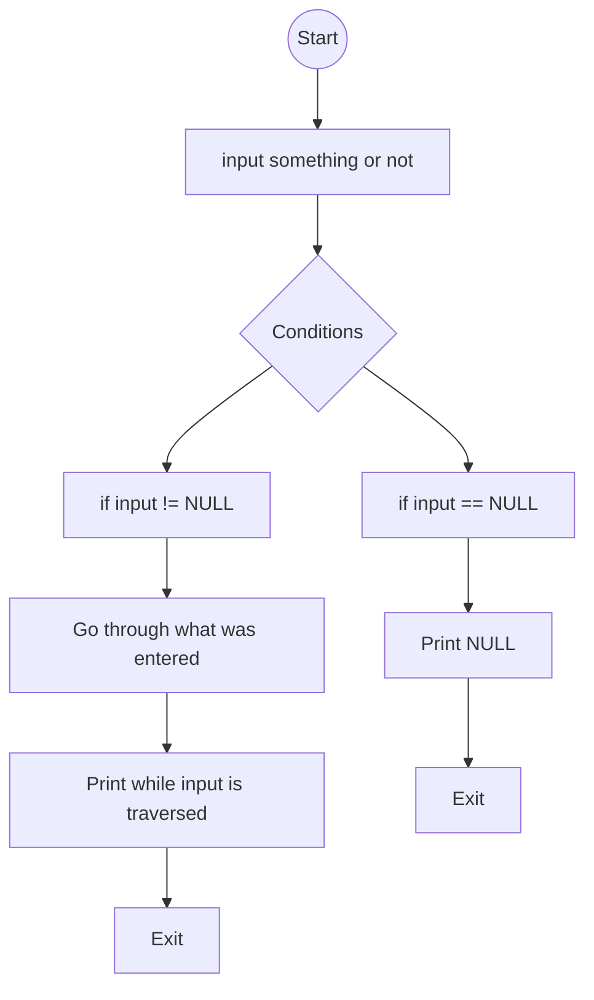

# README for _printf project repository

This repository contains our printf function for holberton.

Project: 0x11. C - printf

Write your own printf function.

# Information

In this project we need to write a function that works similar to the original function printf in 'C', for to do this task first we start for understand the function and how printf does this function we make a very basic flowchart with the things that we believe that printf does, after that we started for writing all the functions that we use later and creating the header file with all the libraries and prototypes that we use in the program.

## Files:

- _printf.c - replaces the printf function

- _putchar.c - putchar function, writes the character c to stdout

- holberton.h - header file with all the definitions

- functions.c - storage all the code related to `%d and %i`

- functions2.c - storage all the code related to `%s and %c`.

  ## How to test the "printf function"

-   Clone this [repository](https://github.com/Miguel22247/printf/)
-   mv the file main.c that it's in test folder to printf folder `mv test/main.c /printf/`
-   use  `$ gcc -Wall -Werror -Wextra -pedantic *.c`  to compile it **(If returns an error in printf("Unknown:[%r]"); use `-Wno-format` flag)**
-   run with ./a.out (is the default output)

## Flowchart

# Code Style

Betty Code Style
 
# Tasks done
  
**0. I'm not going anywhere. You can print that wherever you want to. I'm here and I'm a Spur for life**

Write a function that produces output according to a format.

-   Prototype:  `int _printf(const char *format, ...);`
-   Returns: the number of characters printed (excluding the null byte used to end output to strings)
-   write output to stdout, the standard output stream
-   `format`  is a character string. The format string is composed of zero or more directives. See  `man 3 printf`  for more detail. You need to handle the following conversion specifiers:
    -   `c`
    -   `s`
    -   `%`
-   You don’t have to reproduce the buffer handling of the C library  `printf`  function
-   You don’t have to handle the flag characters
-   You don’t have to handle field width
-   You don’t have to handle precision
-   You don’t have to handle the length modifiers

**1. Education is when you read the fine print. Experience is what you get if you don't**

Handle the following conversion specifiers: `%d, %I`  

**2. Just because it's in print doesn't mean it's the gospel**

Create a man page for your function.

# Authors

[Jorge Tuset](https://github.com/jtusetgraniello) and [Miguel Pacheco](https://github.com/Miguel22247) | Cohort 14 | Holberton School

# Copyright

Jorge Tuset and Miguel Pacheco &copy; 2021 | All Rights Reserved
